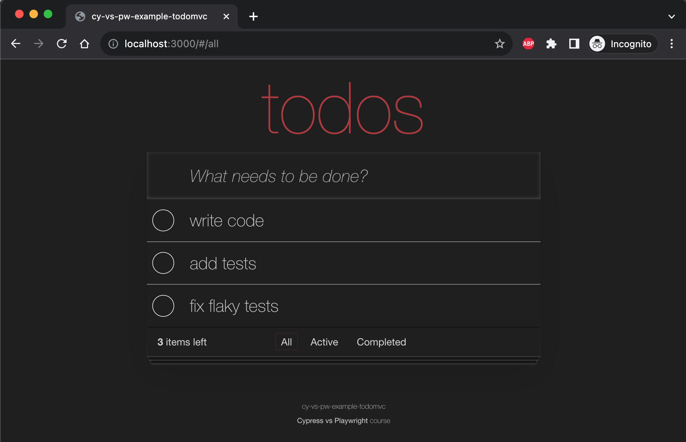

# cy-vs-pw-example-todomvc

> Cypress vs Playwright TodoMVC example app

🎓 See course [Cypress vs Playwright](https://cypress.tips/courses/cypress-vs-playwright) and [Cypress & Playwright Workshop](https://github.com/bahmutov/cypress-workshop-cy-vs-pw)

- [Lesson a1: Add Playwright to TodoMVC app](https://cypress.tips/courses/cypress-vs-playwright/a1)
- [Lesson a2: Add Cypress to TodoMVC app](https://cypress.tips/courses/cypress-vs-playwright/a2)
- [Lesson a3: Where to find help](https://cypress.tips/courses/cypress-vs-playwright/a3)
- [Lesson a4: Start the application before running tests](https://cypress.tips/courses/cypress-vs-playwright/a4)
- [Lesson a5: Playwright UI mode](https://cypress.tips/courses/cypress-vs-playwright/a5)
- [Lesson a6: Reset the server data before each test](https://cypress.tips/courses/cypress-vs-playwright/a6)
- [Lesson a7: Use the base URL](https://cypress.tips/courses/cypress-vs-playwright/a7)
- [Lesson a8: Fail the test if the web application throws an errorL](https://cypress.tips/courses/cypress-vs-playwright/a8)
- [Lesson b1: Test adding a single todo item](https://cypress.tips/courses/cypress-vs-playwright/b1)
- [Lesson b2: Remove code duplicationURL](https://cypress.tips/courses/cypress-vs-playwright/b2)

and many others

